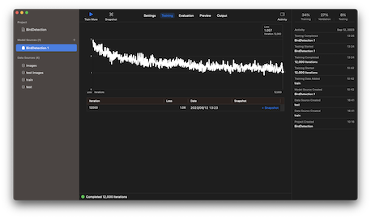

# Bird Detection 2000 Image-Bounding Box Pairs for CoreML

  
[2014-09-24] https://xkcd.com/1425/

---

> Dataset은 kaggle에서 가져왔습니다.
> https://www.kaggle.com/datasets/gpiosenka/birdies  
> License: [CC0: Public Domain](https://creativecommons.org/publicdomain/zero/1.0/)

### About Dataset

- 2010 pairs of images and labels.
- Images are 224 X 224 X 3 in jpg format.
- Labels are in _**Yolo format**_.
- There is only one class.

> **YOLO format**  
> &lt;object-class&gt; &lt;x-center&gt; &lt;y-centers&gt; &lt;width&gt; &lt;height&gt;  
> 
> (example)  
> 0 0.518669 0.487043 0.858766 0.910989

### Usage

```shell
% unzip archive.zip
% pip install Pillow
% python convert_annotation.py
```

#### Output

2010개의 데이터를 train용 1500개와 test용 510개로 분리 저장합니다.

```plain
./train
    ├── 0001.jpg
    ├── ...
    └── annotation.json
./test
    ├── 1501.jpg
    ├── ...
    └── annotation.json
```

#### `annotation.json` format

```json
[
  {
    "image": "1053.jpg",
    "annotations": [
      {
        "label": "bird",
        "coordinates": { 
            "x": 74, "y": 10, "width": 717, "height": 309
        }
      }
    ]
  },
  ...
]
```

### Training

1. CreateML

- `Train Data` 에 train 디렉토리 지정
- `Test Data` 에 text 디렉토리 지정


2. Training

- `Train` 버튼을 눌러 학습 시작



4. Model

- `Get` 버튼을 눌러 mlmodel 파일 저장


